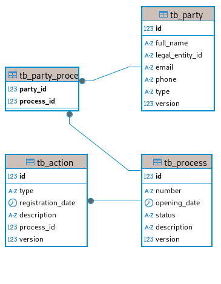
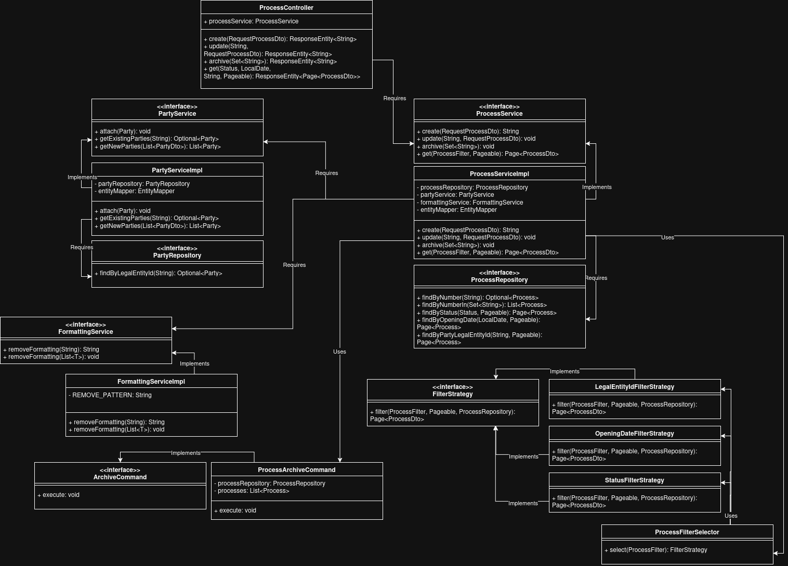

# Proposta de arquitetura

## Camada de apresentação

* Exposição de endpoints REST para que os usuários possam registrar, atualizar, consultas e arquivar processos;

## Camada de Domínio

Representando as entidades e definições de relacionamento (Process, Party, Contact e Action).

## Camada de Transferência

Definição dos DTOs para transferir dados entre as camadas de apresentação e serviço a fim de proteger informações confidenciais quando aplicável.

## Camada de Serviço

* Lógica de negócio, validação para criação, atualização e arquivamento de registros e comunicação entre a camada de apresentação e persistência.

## Camada de Persistência

* Mapeamento de entidades utilizando JPA/Hibernate para interação com o banco de dados. Responsável pela definição dos repositórios.

## Banco de Dados

* SGBD relacional PostgreSQL para armazenamento de tabelas conforme regras e restrições de integridade definidas.

## Aspectos de Segurança e Testes

* Spring Security com JWT para autenticação e autorização stateless e TLS para proteção dos dados em transferência.  
* Testes unitários utilizando Mockito.

## Migração de Dados

* Utilização de Flyway para migração do banco de dados de forma contínua e estruturada.

## Variáveis de Ambiente
Para deploy com [docker-compose.yml](docker-compose.yml) criar os arquivos .env (.env e .env.postgres) e configurar as variáveis:
- .env
```text
SECRET_KEY
TLS_KEY
```

- .env.postgres
```text
POSTGRES_USER
POSTGRES_PASSWORD
POSTGRES_DB
POSTGRES_HOST
POSTGRES_PORT
```

## Gerar JWT
Foi adicionado na pasta `test-only` a classe [Unsecure.java](test-only/unsecure/Unsecure.java), pode-se utilizar com a mesma `SECRET_KEY` da aplicação e criar um JWT compatível para fins de teste.

## TLS
Requer certificado `keystore.p12` no `classpath`.

## Diagrama


